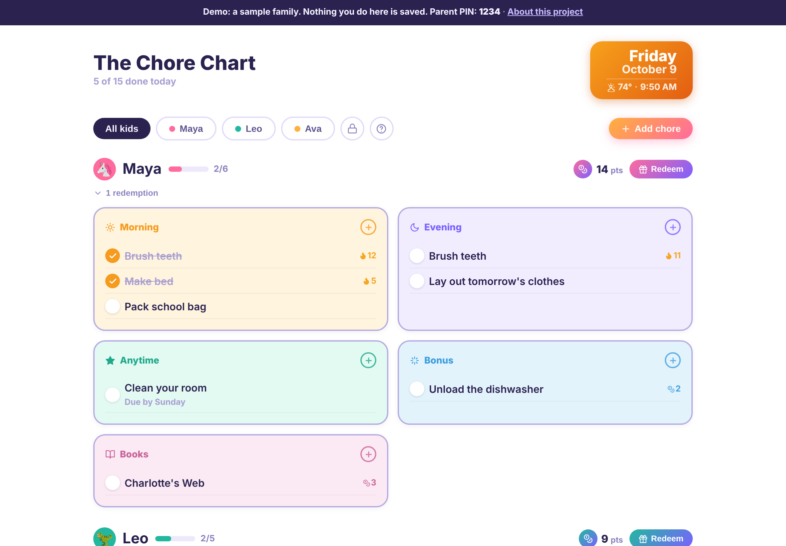
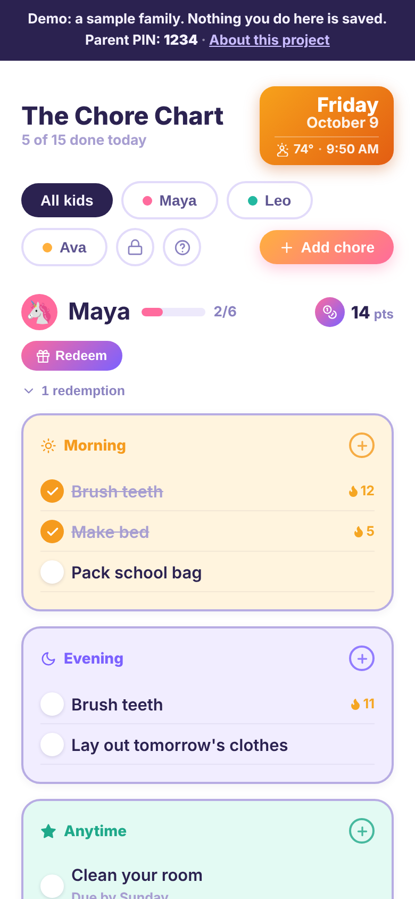
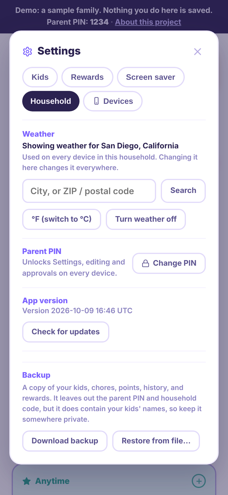
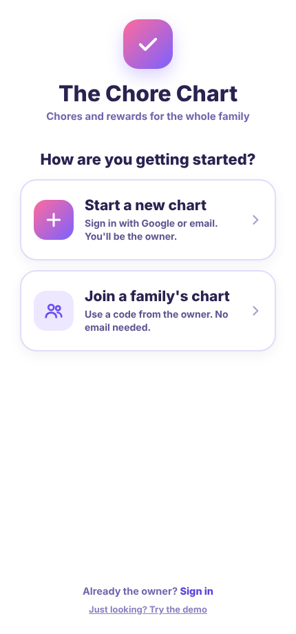
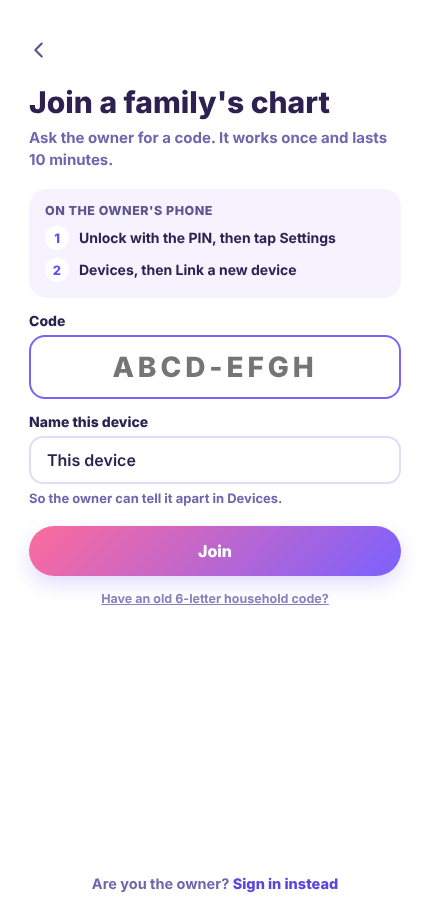

# The Chore Chart

A shared chore and rewards chart for families. It runs on a kitchen tablet the kids use themselves, and on the parents' phones, all kept in sync live.

**[▶ Try the live demo](https://chore-chart-nsr.neil-rothstein.workers.dev/?demo)**: a sample family, no sign-in, nothing saved. The parent PIN is `1234`.

## Why I built it

I built it for fun, and to solve a real problem at home. I wanted a chore chart my kids could run themselves on a tablet: check off their routines, see their streaks, and spend the points they earn, while parents keep control. I had specific features in mind and didn't want to pay for an app, so I built my own. Our family uses it at home on an iPad.

## What it does

- **Five kinds of chores:** Morning and Evening routines that reset each day, Anytime chores with due days, optional Bonus chores worth points, and a Books list that keeps a permanent reading record.
- **Points, streaks and rewards:** finishing the day earns a point, some chores pay their own, and kids redeem points from a reward menu the parents set up. Every day is logged, so parents can see the history.
- **Kid-safe by design:** kids can check off chores and add their own; editing, rewards and settings sit behind a parent PIN that re-locks after 2 minutes of inactivity. Adding a chore that's worth points needs a parent's approval.
- **Built for a wall tablet:** a clock screen saver, updates that install themselves when the tablet is idle (it runs locked in iPad Guided Access, so nobody can refresh it), and a date card that changes color with the local weather.
- **Accounts without friction:** one parent owns the household and signs in with Google or email. Every other device, from the kitchen tablet to a grandparent's phone, joins with a one-time 8-character code and never needs an email. The owner can remove a device, sign out every other device, or hand ownership to someone else.

| Phone | Settings | First screen | Joining with a code |
|---|---|---|---|
|  |  |  |  |

## Decisions worth noting

- **Devices, not child accounts.** Kids don't have email addresses, and signing a parent's Google account into a shared tablet would expose their Gmail. So the tablet gets an anonymous identity that the owner links with a one-time code, and can remove at any time.
- **The PIN separates parents from kids, not the device.** The other parent joins with a code like the tablet does, and uses the PIN for parent controls. Only the owner's own sign-in can manage devices or reset a forgotten PIN.
- **No location tracking.** Weather comes from a city or postal code the owner types in once for the whole household. An earlier version could use a device's location; I removed it after thinking through a parent traveling and accidentally moving the home tablet's weather to a hotel.
- **Moving existing families over safely.** Households that pre-dated accounts kept working with their old code for 14 days after being secured, so no device was locked out mid-week.
- **Updates that reach a locked-down tablet.** The app checks for new versions on its own and reloads only when nobody is using it.

## How it's built

- **App:** React, compiled with esbuild into a single page that installs as a home-screen app (PWA), with a service worker for offline loading and self-updating.
- **Data and accounts:** Firebase: Firestore for the shared household data with live sync, Firebase Authentication (Google, email and password, and anonymous devices), and Cloud Functions for everything that grants access, such as creating households, redeeming join codes and transferring ownership. Firestore security rules enforce who can read what.
- **Hosting and deploys:** Cloudflare Workers. Every push to `main` deploys automatically.
- **Tests:** over 220 automated checks. They cover 39 server tests for the account logic, plus end-to-end browser tests (Playwright) that drive the real app across several simulated devices, with Firebase replaced by a fake that runs the real server code.
- **Weather:** Open-Meteo, a free service that needs no API key.

## How I built it

I'm the product owner of this project: I defined what it should do, made the design and privacy calls, reviewed new screens as mockups before they were built, and tested each release on real devices, including our locked-down iPad. The code was written with an AI coding assistant (Claude), working from those decisions in small, tested steps. The commit history shows that progression.

## Repository layout

| Path | What's there |
|---|---|
| `chore-tracker.jsx` | The app |
| `_build/` | Build script, account and sync code, service worker, demo mode, and tests |
| `public/` | The built site that Cloudflare serves |
| `firebase/` | Cloud Functions, security rules and their tests |
| `chore-chart-guide.md` | The guide for families using the app |

To build: `python3 _build/build.py`. To run the server tests: `node firebase/functions/test/handlers.test.js`.
